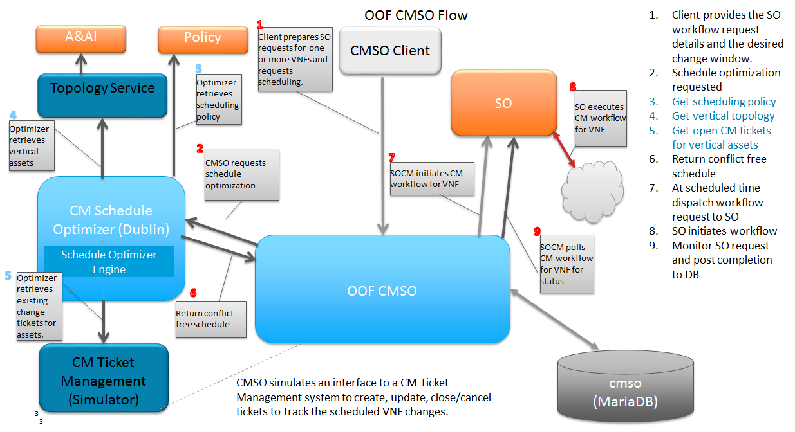

.. This work is licensed under a Creative Commons Attribution 4.0 International License.

Architecture
=============================================

Introduction
------------------
OOF-CMSO is an optimizing service that allows for the scheduling of VNF change management
work flows to be executed at a time in the future. It enables a 3rd party client to provide 
SO work flow requests for multiple VNFs to be executed within a provided change window. The schedule 
optimizer is designed to determine a "conflict free" time within that change window that is suitable for 
submitting the changes to SO. 

The Dublin release provides a an schedule optimizer framework that provides an interface to a model driven schedule optimizer developed using MiniZinc technolgy to provide a best effort at a conflict free schedule.  Inputs to the schedule optimizer require network topology and and scheduled change information on relevant network elements in order to do conflict avoidance. To this end, a Change Management Topology and Ticket Management interfaces were designed to abstract the vendor specific topology and availability data required for schedule optimization. Dublin provides skeletal implementations of these services.

 * Dublin does not include an interface to SO for initiating the work flows and checking status. Rather, it has been suggested that a SO dispatcher service be provided to manage the runtime SO workload. While CMSO may take into account work scheduled for SO when creating a schedule. it is outside the domain of CMSO to manage the runtime actual workload on a target service such as SO. 
 * Dublin Topology and Ticket Management simulator services are skeletal interfaces. These services will be expanded in El Alto to provide data to support additional conflict avoidance test cases.  Currently, only sunny day test cases are implemented in the CSIT test suite. 

CMSO also models interfacing an external ticket/change management system to create, update, close/cancel tickets at relevant points in the CMSO flow.

CMSO in Change Management Flow
--------------------------------------------
CMSO is designed to be agnostic of the type of change management work flow that is to be scheduled in SO. A 3rd party
client application will be responsible for preparing the change management request messages to be forwarded to SO. This data,
along with the list of targeted VNFs and the scheduling requirements are used by CMSO to create and ultimately execute
the schedule to dispathc the work to SO.

The information provided to CMSO to accomplish the scheduling of the changes:

 * Work flow information

   * Name of the work flow
   * Message(s) to be forwarded to SO to initiate the work flow

 * Schedule information

   * The list of targeted VNFs
   * The desired change window

     * Earliest start date/time
     * Latest end date/time

   * Expected duration of the work flow execution
   * Number of concurrent work flows to be scheduled

The design of CMSO is to ensure that the scheduling of the work flows will not conflict with other scheduled work.

 #. Ensure that asset(s) required to execute the work flow are available so that the work flow will be able to complete successfully
 #. Ensure that the execution of the work flow does not cause a network outage.

Architectural Flow Diagram
^^^^^^^^^^^^^^^^^^^^^^^^^^^^

Scheduling Optimization and Confict Avoidance
-----------------------------------------------

The Dublin implementation of CMSO implements an Optimization service that provides conflict avoidance.  The optimized schedule
provides a start time for each VNF in the schedule.

Conflict avoidance to achieve the goals of CMSO, successful completion of change requests  without incurring network outages,
requires a system to track the availability (or rather unavailability) of assets required to determine an
optimal time for exectution. No such change management system exists at this time within ONAP, however, Dublin CMSO defines an interface that abstracts the Change Management Ticket information necessary for the schedule optimizer engine to determine element availability.

SO Change Request Dispatching
^^^^^^^^^^^^^^^^^^^^^^^^^^^^^^

CMSO does not serve as a throttling dispatcher to SO. Rather, the dispatching of work to SO is based solely on
the start time assigned to each VNF. CMSO will dispatch a VNF change to SO regardless of how many outstanding
change management requests there are to SO within CMSO.

It has been proposed that a dispatcher service be defined to enable applications such as SO to manage the runtime workload of the service. The dispatcher would respond to system busy indicators to determine the disatch disposition of a request. For example, time sensitive may be rejected if they cannot be serviced in a particular time window while others may be held based upon priority. 

