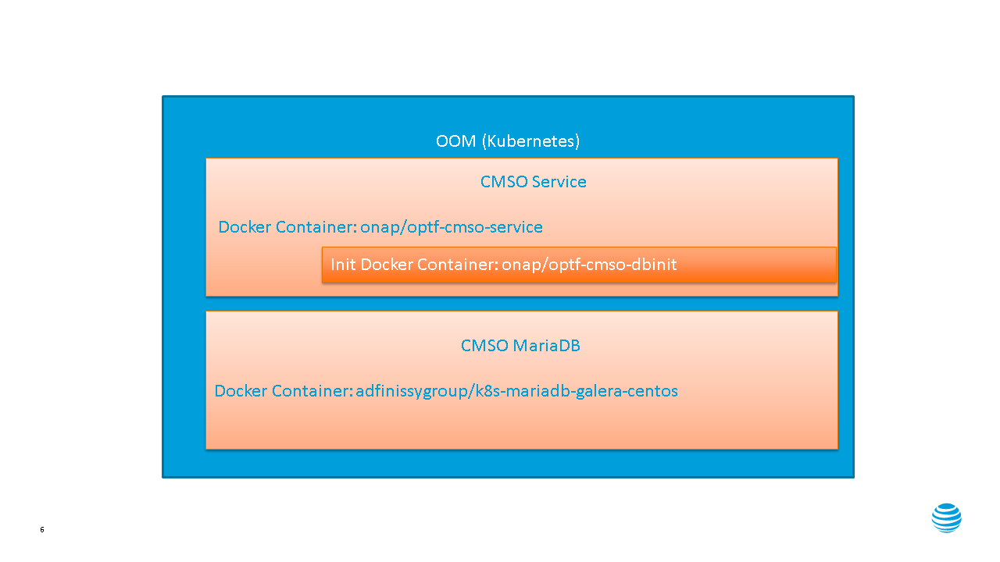

OOF CMSO Delivery
======================

OOF CMSO is made up of 3 docker containers

 #. CMSO Service - Java server (Jersey)
 #. CMSO Database Initialization - Java wrapper invoking Liquibase schema management scripts
 #. MariaDB - OOM Common mariadb-galera server

The OOM Helm Charts are located here:

https://gerrit.onap.org/r/gitweb?p=oom.git;a=tree;f=kubernetes/oof/charts/oof-cmso;h=2cbb8cd2178077575cd03a4dfb359b2c941ba2db;hb=HEAD

OOF CMSO Delivery Diagram
------------------------------

